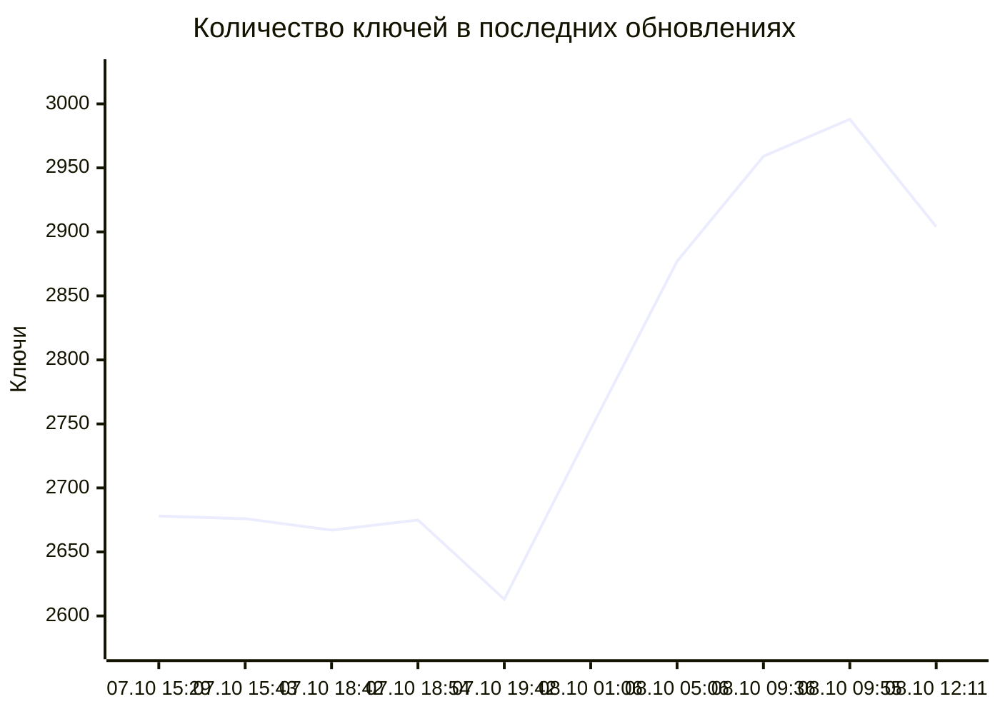

# WireVeil

WireVeil — автономный, автоматически обновляемый агрегатор публичных прокси-ключей для клиентов на базе Xray и sing-box. Он собирает все доступные конфигурации для обычного режима чёрных списков, строго проверяет URI, оставляет только один ключ на сочетание «протокол + сервер + порт» и исключает только подтверждённые российские endpoints.

Поддерживаются VLESS, Trojan, Shadowsocks, VMess, Hysteria, Hysteria2 (`hy2://` и `hysteria2://`) и TUIC. В каждой сборке обязательны шесть актуальных типов: VLESS, Trojan, Shadowsocks, VMess, Hysteria2 и TUIC. Парсер и отдельный файл Hysteria v1 сохраняются для совместимости, но этот устаревший тип сейчас отсутствует в выбранных живых источниках. WireGuard, AmneziaWG, многострочные конфигурации, JSON/YAML-клиенты и целиком Base64-кодированные выходные подписки не публикуются.

## Подписки

<!-- WIREVEIL_STATS_START -->
Последнее успешное обновление: **2026-10-08T12:11:26+03:00** (UTC: 2026-10-08T09:11:26Z).

| Подписка | RAW-ссылка | Ключей | Размер |
|---|---|---:|---:|
| Все протоколы | [RAW](https://raw.githubusercontent.com/markKikhtenko/WireVeil/main/subscription.txt) | 2904 | 589.1 KiB |
| VLESS | [RAW](https://raw.githubusercontent.com/markKikhtenko/WireVeil/main/vless.txt) | 858 | 196.7 KiB |
| Trojan | [RAW](https://raw.githubusercontent.com/markKikhtenko/WireVeil/main/trojan.txt) | 968 | 152.2 KiB |
| Shadowsocks | [RAW](https://raw.githubusercontent.com/markKikhtenko/WireVeil/main/shadowsocks.txt) | 245 | 21.8 KiB |
| VMess | [RAW](https://raw.githubusercontent.com/markKikhtenko/WireVeil/main/vmess.txt) | 385 | 128.4 KiB |
| Hysteria | [RAW](https://raw.githubusercontent.com/markKikhtenko/WireVeil/main/hysteria.txt) | 0 | 0 B |
| Hysteria2 | [RAW](https://raw.githubusercontent.com/markKikhtenko/WireVeil/main/hysteria2.txt) | 194 | 22.4 KiB |
| TUIC | [RAW](https://raw.githubusercontent.com/markKikhtenko/WireVeil/main/tuic.txt) | 254 | 67.7 KiB |

### Вклад источников в текущую сборку

`В итоговой подписке` — число ключей источника, оставшихся после валидации, приоритетной дедупликации и геофильтра.

| Источник | Статус | Распознано | Валидно | В итоговой подписке |
|---|---|---:|---:|---:|
| igareck Blacklist Mobile Top | ok | 150 | 150 | 97 |
| igareck Blacklist Mixed | ok | 348 | 346 | 162 |
| WLUnlocker Blacklist VPN 1 | ok | 142 | 139 | 42 |
| FLAT447 Blacklist LTE | ok | 268 | 268 | 204 |
| WLUnlocker Blacklist VPN 2 | ok | 200 | 200 | 100 |
| 0xRadikal Verified | ok | 885 | 876 | 513 |
| morpheusadam TUIC | ok | 257 | 256 | 253 |
| Argh94 All Config | ok | 2544 | 2492 | 1533 |

### История обновлений

Время указано по Москве. `Добавлено` и `удалено` считают изменения состава URI; для записей, созданных до появления этого учёта, доступно только чистое изменение `Δ`.

| Обновлено (МСК) | Всего | Добавлено | Удалено | Δ | Что изменилось |
|---|---:|---:|---:|---:|---|
| 07.10.2026 15:29 МСК | 2678 | +728 | −727 | +1 | VLESS +316/−178; Trojan +330/−266; SS +26/−20; VMess +41/−248; Hysteria2 +14/−15; TUIC +1/−0 |
| 07.10.2026 15:43 МСК | 2676 | +201 | −203 | -2 | VLESS +106/−120; Trojan +76/−69; SS +2/−4; VMess +17/−10 |
| 07.10.2026 18:42 МСК | 2667 | +314 | −323 | -9 | VLESS +209/−195; Trojan +65/−92; SS +17/−14; VMess +13/−14; Hysteria2 +10/−8 |
| 07.10.2026 18:54 МСК | 2675 | +197 | −189 | +8 | VLESS +105/−101; Trojan +66/−59; SS +5/−7; VMess +21/−22 |
| 07.10.2026 19:42 МСК | 2613 | +180 | −242 | -62 | VLESS +91/−138; Trojan +51/−67; SS +4/−7; VMess +27/−23; Hysteria2 +7/−7 |
| 08.10.2026 01:06 МСК | 2746 | +888 | −755 | +133 | VLESS +342/−424; Trojan +275/−148; SS +181/−59; VMess +38/−52; Hysteria2 +38/−44; TUIC +14/−28 |
| 08.10.2026 05:06 МСК | 2877 | +1019 | −888 | +131 | VLESS +564/−257; Trojan +314/−411; SS +65/−157; VMess +45/−32; Hysteria2 +31/−31 |
| 08.10.2026 09:36 МСК | 2959 | +953 | −871 | +82 | VLESS +330/−501; Trojan +295/−224; SS +52/−85; VMess +257/−39; Hysteria2 +19/−22 |
| 08.10.2026 09:55 МСК | 2988 | +189 | −160 | +29 | VLESS +129/−112; Trojan +34/−24; SS +5/−7; VMess +21/−17 |
| 08.10.2026 12:11 МСК | 2904 | +498 | −582 | -84 | VLESS +290/−352; Trojan +101/−153; SS +15/−14; VMess +28/−33; Hysteria2 +64/−30 |


<!-- WIREVEIL_STATS_END -->

`stats.json` содержит подробную статистику, размеры и SHA-256 текущей сборки. В `update-history.json` хранятся последние 20 успешных обновлений.

### Проверенные подключения

<!-- WIREVEIL_HEALTH_START -->
Последняя проверка реального подключения: **2026-10-08T12:15:31+03:00** (UTC: 2026-10-08T09:15:31Z). Проверено через `sing-box version 1.14.0`: **802 из 2904** конфигураций передали HTTPS-трафик; после endpoint-дедупликации опубликовано **802**.

| Подписка | RAW-ссылка | Ключей | Размер |
|---|---|---:|---:|
| Только активные и проверенные | [RAW](https://raw.githubusercontent.com/markKikhtenko/WireVeil/main/active.txt) | 802 | 161.5 KiB |
| Рабочие и быстрые (≤ 500 мс) | [RAW](https://raw.githubusercontent.com/markKikhtenko/WireVeil/main/good.txt) | 544 | 104.6 KiB |
<!-- WIREVEIL_HEALTH_END -->

Подписки образуют три уровня:

- `subscription.txt` — все кандидаты из доступных источников после геофильтра и endpoint-дедупликации.
- `active.txt` — все реально рабочие ключи по результатам текущего HTTPS-теста через `sing-box`. Повторные сочетания «протокол + сервер + порт» схлопываются с сохранением самого быстрого рабочего варианта. Медленные, но рабочие серверы остаются здесь.
- `good.txt` — рабочие и быстрые: подмножество уже сформированного `active.txt` с измеренной задержкой **не выше 500 мс** по умолчанию и без зафиксированных ошибок. Порог настраивается; URI и их относительный порядок сохраняются.

`good.txt` использует задержку HTTPS-проверки, которую уже возвращает локальный Clash API sing-box. Таймауты, ошибки, отсутствие корректной задержки и превышение порога исключают ключ только из `good.txt`. Если первый HTTPS endpoint завершился ошибкой, а запасной сработал, ключ остаётся в `active.txt`, но не проходит фильтр `good.txt`. Дополнительные запросы и ping не выполняются; текущая логика sing-box healthcheck и отбора `active.txt` сохраняется.

Это оценка по текущему прогону, а не проверка долговременной стабильности. Доступность и задержка зависят от сети, где запущен health-check: автоматическая публикация проверяется с GitHub-hosted runner, а локальный запуск — с текущей машины. Ни один из этих результатов не гарантирует такую же доступность у конкретного российского провайдера.

## Источники

| Источник | Назначение | Приоритет |
|---|---|---:|
| [igareck Blacklist Mobile Top](https://raw.githubusercontent.com/igareck/vpn-configs-for-russia/refs/heads/main/BLACK_VLESS_RUS_mobile.txt) | Компактная подборка лучших проверенных конфигураций | 100 |
| [igareck Blacklist Mixed](https://raw.githubusercontent.com/igareck/vpn-configs-for-russia/refs/heads/main/BLACK_SS%2BAll_RUS.txt) | Проверенные альтернативные протоколы | 95 |
| [WLUnlocker Blacklist VPN 1](https://raw.githubusercontent.com/wlunlocker/vpn-configs/main/blacklist_vpn1.txt) | Компактная VLESS-подписка | 90 |
| [FLAT447 Blacklist LTE](https://raw.githubusercontent.com/FLAT447/v2ray-lists/refs/heads/main/BLACK_LTE.txt) | Компактная подборка для российского режима чёрных списков | 85 |
| [WLUnlocker Blacklist VPN 2](https://raw.githubusercontent.com/wlunlocker/vpn-configs/main/blacklist_vpn2.txt) | Компактная Shadowsocks/Hysteria2-подписка | 80 |
| [0xRadikal Verified](https://raw.githubusercontent.com/0xRadikal/Free-v2ray-Configs/main/verified/configs.txt) | Конфигурации после трёх раундов реальных proxy-запросов | 70 |
| [morpheusadam TUIC](https://raw.githubusercontent.com/morpheusadam/v2ray-config/main/subs/bundles/tuic.txt) | Ежедневно проверяемый резерв TUIC | 55 |
| [Argh94 All Config](https://raw.githubusercontent.com/Argh94/Proxy-List/main/All_Config.txt) | Широкий резерв актуальных URI-протоколов | 50 |

Полная машиночитаемая конфигурация находится в [`sources.json`](./sources.json). Источник с более высоким приоритетом побеждает при обнаружении семантически одинаковых ключей.

## Использование

Добавьте RAW-ссылку `good.txt` для рабочих и быстрых серверов, `active.txt` для всех проверенных рабочих или `subscription.txt` для полного пула кандидатов, если клиент поддерживает URL-подписки с обычным списком URI. Если установленная версия клиента умеет импортировать только отдельные ключи, откройте нужный RAW-файл из таблицы, скопируйте строки и добавьте их вручную. Каждый файл — обычный UTF-8 TXT: один исходный URI на строку, без Base64-обёртки.

Проект рассчитан прежде всего на обычное проводное подключение и конфигурации для обхода чёрных списков. Он намеренно не создаёт и не изменяет подписки для модемных роутеров.

## Портативная проверка из своей сети

[**⬇ Скачать WireVeilChecker для Windows x64 (portable ZIP)**](https://github.com/markKikhtenko/WireVeil/releases/latest/download/WireVeilChecker-windows-x64.zip)

`WireVeilChecker` — графическое Windows-приложение без установки. Оно принимает URL, файл или вставленный текст подписки NekoBox, запускает вложенный `sing-box` и проверяет каждый сервер реальным HTTPS-запросом именно из текущей сети. Обычный ICMP-ping намеренно не используется: сервер может блокировать его, а доступный порт ещё не означает, что прокси передаёт трафик.

Приложение и его окно используют собственную многоразмерную иконку WireVeil вместо стандартного значка Python/Tk.

Стартовый экран сделан для одного действия: вставить подписку и нажать красную кнопку «Сделать заебись». Ручные прогоны, тайм-аут, число потоков, порог ping и выбор сайтов спрятаны под кнопкой «Дополнительные настройки». По умолчанию каждый узел должен успешно пройти два независимых прогона. Весь список показывается сразу, а задержка обновляется в строке по мере ответа каждого сервера. Любая колонка сортируется кликом по заголовку в обе стороны, включая меньший/больший ping. Можно выделить несколько строк через Ctrl/Shift и скопировать их кнопкой или Ctrl+C. После проверки можно сохранить все живые серверы, только быстрые либо скопировать годные share-ссылки прямо в буфер обмена для NekoBox.

Настройки и содержимое поля подписки автоматически сохраняются в `WireVeilChecker.config.json` рядом с `WireVeilChecker.exe` и восстанавливаются при следующем запуске. В конфиг входят параметры проверки, интервал и состояние авторежима, выбранные сайты, видимость расширенной панели, а также URL либо вставленные ключи подписки. Файл остаётся только на компьютере и исключён из Git; поскольку ключи хранятся в нём обычным текстом, конфиг не следует публиковать или передавать посторонним.

Кнопка «Очистить» рядом с полем подписки удаляет и видимый текст, и сохранённое значение. Для редактирования поля явно поддерживаются Ctrl+C, Ctrl+V, Ctrl+X и Ctrl+A при английской и русской раскладке, а также Ctrl+Insert и Shift+Insert.

Отдельная проверка сайтов запускается для зелёных серверов. В выпадающем меню с галочками можно одновременно выбрать ChatGPT, YouTube, GitHub, Google, Discord и Telegram Web. Для каждого выбранного сервиса появляется собственная сортируемая колонка с доступностью и задержкой, поэтому общий зелёный HTTPS-тест не маскирует блокировку конкретного домена. При изменении выбора старые результаты очищаются; cookies и данные учётных записей не используются. Поэтому ответ ChatGPT `HTTP 401/403` помечается как «домен отвечает» и считается успешной сетевой доступностью: он подтверждает, что запрос дошёл до сервиса, хотя не подтверждает вход в аккаунт или полноценную работу браузерной сессии.

После сервисного теста умная итоговая сортировка ставит наверх серверы, открывшие все выбранные сайты: только они остаются зелёными и попадают в экспорт «годных». Частичный доступ отмечается жёлтым, отсутствие доступа — красным, поэтому низкий общий ping больше не скрывает неработающий целевой сервис. Красная кнопка «Сделать заебись» запускает полный сценарий без ручной настройки: ping, скорость зелёных, все сайты, итоговая сортировка и копирование полностью прошедших ключей в буфер. Авторежим повторяет именно этот полный сценарий через выбранное число минут и заново загружает URL подписки.

Отдельный флажок «Контроль скопированных зелёных» предназначен для лёгкой фоновой проверки. При копировании годных приложение запоминает этот набор, а затем с выбранным интервалом (по умолчанию 30 минут) выполняет для него только один реальный HTTPS-прогон живости. Подписка заново не загружается, скорость и сайты не тестируются. Таблица показывает, сколько из ранее скопированных серверов живы прямо сейчас; исходный набор сохраняется, поэтому временно упавший сервер будет проверен снова в следующий раз.

Пинг и скорость отображаются раздельно. Тест скорости выполняет дополнительную загрузку 1 МБ через каждый итоговый зелёный сервер и показывает пропускную способность в Мбит/с; красные, жёлтые и не прошедшие все прогоны узлы этот трафиковый тест не запускают. Его можно вызвать отдельно из дополнительных настроек либо как часть явно запущенного полного цикла и авторежима.

Готовый `WireVeilChecker-windows-x64.zip` публикуется в [GitHub Releases](https://github.com/markKikhtenko/WireVeil/releases) для тегов `checker-v*`. Достаточно распаковать архив и запустить `WireVeilChecker.exe`; Python, NekoBox и права администратора для самой проверки не нужны. Исходный код интерфейса находится в [`checker_app.py`](./checker_app.py), подробная инструкция — в [`PORTABLE-CHECKER.md`](./PORTABLE-CHECKER.md).

Релизы сейчас публикуются без Authenticode-подписи, пока сертификат не добавлен в GitHub Secrets, поэтому Windows Defender/SmartScreen может показать предупреждение. После настройки по инструкции [`SIGNING.md`](./SIGNING.md) workflow автоматически подпишет приложение, вложенный `sing-box` и библиотеку перед упаковкой ZIP.

Поддерживаются VLESS, Trojan, Shadowsocks, VMess, Hysteria2 и TUIC в виде share-ссылок, в том числе Base64-подписки. Клиентские JSON/YAML-конфигурации без share-ссылок, WireGuard и AmneziaWG пока не поддерживаются.

## Локальная сборка

Нужен Python 3. Внешних зависимостей нет.

```bash
python -m unittest discover -s tests -v
python scripts/build.py
python scripts/healthcheck.py --sing-box /path/to/sing-box
```

Сборщик повторяет временно неудачные запросы, требует доступности всех основных источников, однократно распознаёт Base64-обёрнутый вход и сначала проверяет полный результат во временной директории. Сначала удаляются полностью эквивалентные конфигурации, затем для каждого сочетания «протокол + сервер + порт» остаётся ключ из источника с наивысшим приоритетом. После этого применяется геофильтр и публикуется весь оставшийся пул. Публикация отменяется, если ключей меньше защитного минимума, отсутствует любой из шести обязательных актуальных протоколов или результат не проходит проверку. При необходимости параметры `--target-keys` и `--max-keys` позволяют вручную вернуть точную выборку и верхний предел.

После сборки health-check запускает закреплённый официальный `sing-box`, конвертирует поддерживаемые URI в отдельные outbounds и проверяет каждый через один из двух HTTPS `generate_204` endpoints посредством локального Clash API. ICMP-пинг не используется. Неподдерживаемые, не подключившиеся и не передавшие HTTPS-трафик ключи не попадают в `active.txt`; при системной ошибке или слишком малом результате последняя рабочая активная подписка не перезаписывается. Подробности последнего прогона находятся в `active-stats.json`.

Фильтр качества настраивается в [`healthcheck-config.json`](./healthcheck-config.json), который команда healthcheck читает автоматически:

```json
{
  "good": {
    "enabled": true,
    "max_latency_ms": 500
  }
}
```

`max_latency_ms` — положительное целое число в миллисекундах; равенство порогу допускается. Для другой конфигурации используйте `python scripts/healthcheck.py --sing-box /path/to/sing-box --config /path/to/config.json`. JSON читается стандартной библиотекой Python, дополнительные зависимости не нужны. Изменение файла конфигурации запускает существующий workflow обновления.

При `enabled: false` успешный прогон публикует пустой `good.txt` и `total_good: 0`, чтобы не оставлять устаревшую подборку. Пустой результат фильтра также допустим при включённом фильтре: он не отменяет публикацию `active.txt`. Прежний защитный минимум `--min-active` применяется только к активным ключам. Все выходные файлы сначала проверяются во временной директории; при ошибке проверки или недостижении минимума предыдущие подписки и статистика сохраняются.

В `active-stats.json` сохраняются прежние поля и дополнительные данные:

- `total_active` и `total_good` — число опубликованных ключей после endpoint-дедупликации.
- `latency_min`, `latency_avg`, `latency_max` — минимум, среднее и максимум измеренных задержек в `active.txt`, в миллисекундах. Эти же поля внутри `good` описывают только `good.txt`; при отсутствии измерений значения равны `null`.
- `active_by_protocol` и `good_by_protocol` — распределение по протоколам для каждой подписки, включая нулевые значения.
- `good.enabled` и `good.max_latency_ms` — настройки, применённые в этом прогоне.
- `probe_results` — сохранённые результаты каждой проверки: `candidate_index` (индекс строки кандидата с нуля), `uri_sha256` (SHA-256 исходного URI в UTF-8 без перевода строки), `active`, `latency_ms` и `error`. Неуспешная проверка имеет `latency_ms: null`; успех через запасной URL после ошибки первого запроса сохраняет и задержку, и предыдущую ошибку. Поле `candidate_subscription_sha256` связывает результаты с проверенным пулом.
- `output_file` и `good_output_file` — число ключей, размер и SHA-256 файлов `active.txt` и `good.txt` соответственно.

При добавлении фильтра начальный `good.txt` оставлен пустым до первого успешного healthcheck с новой логикой публикации. Старые отчёты `active-stats.json` содержат только агрегаты задержек: восстановить по ним качество отдельных серверов нельзя. Следующий успешный прогон автоматически заполняет подписку и добавляет новые поля статистики.

Геофильтр определяет страну только по фактическому адресу `server`: доменное имя разрешается в IP, затем точное назначение адреса проверяется через authoritative RDAP. Это важно для небольших российских сетей, переприсвоенных внутри крупного иностранного блока и потому отсутствующих в верхнеуровневой статистике делегаций. Ответы RDAP кешируются по возвращённому диапазону в `geo-cache.json` на семь дней. SNI, Host, флаг и подпись ключа не используются как доказательство страны. Подтверждённые RU-endpoints исключаются, а `UNKNOWN` сохраняются.

## Важное предупреждение

Это публичные бесплатные серверы третьих лиц. WireVeil не владеет ими, не управляет ими и не гарантирует их доступность, конфиденциальность или безопасность. Оператор сервера потенциально может наблюдать незашифрованный трафик и метаданные. Не передавайте через непроверенные серверы чувствительные данные, используйте сквозное шифрование и считайте любой ключ недоверенным.

Используйте WireVeil только в законных целях и с соблюдением применимого законодательства и правил используемых сервисов.

Код проекта распространяется по лицензии [MIT](./LICENSE).
