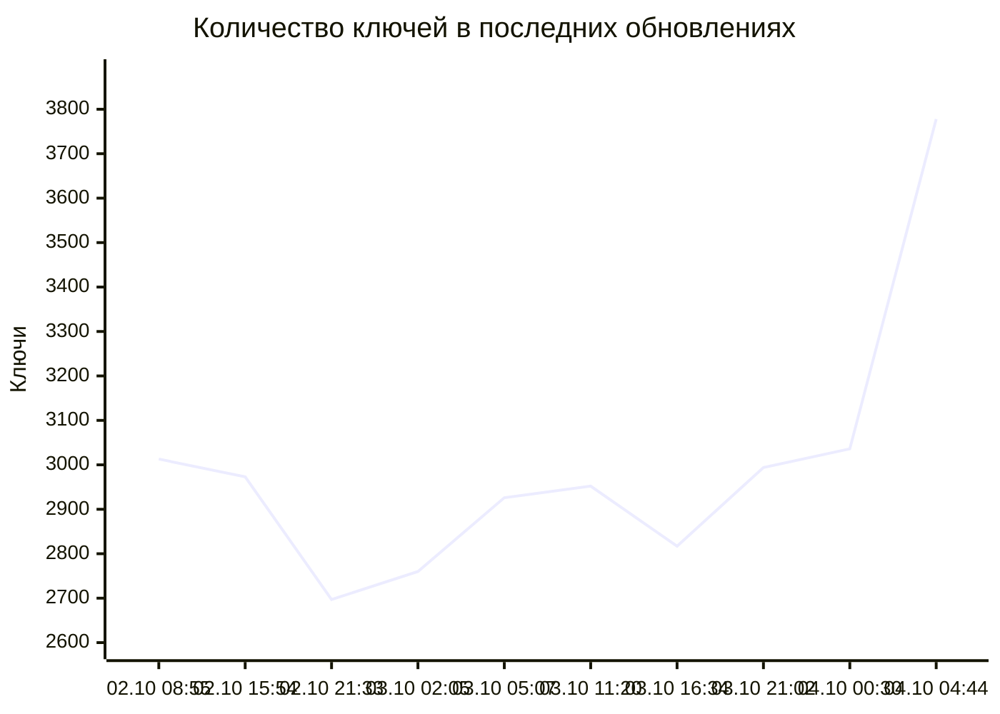

# WireVeil

WireVeil — автономный, автоматически обновляемый агрегатор публичных прокси-ключей для клиентов на базе Xray и sing-box. Он собирает все доступные конфигурации для обычного режима чёрных списков, строго проверяет URI, оставляет только один ключ на сочетание «протокол + сервер + порт» и исключает только подтверждённые российские endpoints.

Поддерживаются VLESS, Trojan, Shadowsocks, VMess, Hysteria, Hysteria2 (`hy2://` и `hysteria2://`) и TUIC. В каждой сборке обязательны шесть актуальных типов: VLESS, Trojan, Shadowsocks, VMess, Hysteria2 и TUIC. Парсер и отдельный файл Hysteria v1 сохраняются для совместимости, но этот устаревший тип сейчас отсутствует в выбранных живых источниках. WireGuard, AmneziaWG, многострочные конфигурации, JSON/YAML-клиенты и целиком Base64-кодированные выходные подписки не публикуются.

## Подписки

<!-- WIREVEIL_STATS_START -->
Последнее успешное обновление: **2026-10-04T04:44:05+03:00** (UTC: 2026-10-04T01:44:05Z).

| Подписка | RAW-ссылка | Ключей | Размер |
|---|---|---:|---:|
| Все протоколы | [RAW](https://raw.githubusercontent.com/markKikhtenko/WireVeil/main/subscription.txt) | 3778 | 690.1 KiB |
| VLESS | [RAW](https://raw.githubusercontent.com/markKikhtenko/WireVeil/main/vless.txt) | 1215 | 274.8 KiB |
| Trojan | [RAW](https://raw.githubusercontent.com/markKikhtenko/WireVeil/main/trojan.txt) | 878 | 114.3 KiB |
| Shadowsocks | [RAW](https://raw.githubusercontent.com/markKikhtenko/WireVeil/main/shadowsocks.txt) | 381 | 37.8 KiB |
| VMess | [RAW](https://raw.githubusercontent.com/markKikhtenko/WireVeil/main/vmess.txt) | 329 | 113.0 KiB |
| Hysteria | [RAW](https://raw.githubusercontent.com/markKikhtenko/WireVeil/main/hysteria.txt) | 0 | 0 B |
| Hysteria2 | [RAW](https://raw.githubusercontent.com/markKikhtenko/WireVeil/main/hysteria2.txt) | 696 | 79.5 KiB |
| TUIC | [RAW](https://raw.githubusercontent.com/markKikhtenko/WireVeil/main/tuic.txt) | 279 | 70.7 KiB |

### Вклад источников в текущую сборку

`В итоговой подписке` — число ключей источника, оставшихся после валидации, приоритетной дедупликации и геофильтра.

| Источник | Статус | Распознано | Валидно | В итоговой подписке |
|---|---|---:|---:|---:|
| igareck Blacklist Mobile Top | ok | 144 | 144 | 82 |
| igareck Blacklist Mixed | ok | 40 | 40 | 5 |
| WLUnlocker Blacklist VPN 1 | ok | 124 | 124 | 34 |
| FLAT447 Blacklist LTE | ok | 58 | 58 | 34 |
| WLUnlocker Blacklist VPN 2 | ok | 200 | 200 | 176 |
| 0xRadikal Verified | ok | 1544 | 1525 | 1132 |
| morpheusadam TUIC | ok | 285 | 282 | 279 |
| Argh94 All Config | ok | 3133 | 3095 | 2036 |

### История обновлений

Время указано по Москве. `Добавлено` и `удалено` считают изменения состава URI; для записей, созданных до появления этого учёта, доступно только чистое изменение `Δ`.

| Обновлено (МСК) | Всего | Добавлено | Удалено | Δ | Что изменилось |
|---|---:|---:|---:|---:|---|
| 02.10.2026 08:55 МСК | 3013 | +1362 | −1515 | -153 | VLESS +527/−390; Trojan +700/−621; SS +42/−73; VMess +52/−237; Hysteria2 +40/−194; TUIC +1/−0 |
| 02.10.2026 15:54 МСК | 2973 | +1328 | −1368 | -40 | VLESS +430/−531; Trojan +627/−703; SS +69/−45; VMess +35/−40; Hysteria2 +167/−48; TUIC +0/−1 |
| 02.10.2026 21:33 МСК | 2697 | +620 | −896 | -276 | VLESS +422/−574; Trojan +37/−120; SS +50/−75; VMess +45/−51; Hysteria2 +66/−76 |
| 03.10.2026 02:05 МСК | 2760 | +667 | −604 | +63 | VLESS +380/−289; Trojan +73/−51; SS +70/−43; VMess +62/−46; Hysteria2 +61/−155; TUIC +21/−20 |
| 03.10.2026 05:07 МСК | 2926 | +682 | −516 | +166 | VLESS +483/−327; Trojan +77/−44; SS +43/−57; VMess +37/−42; Hysteria2 +42/−46 |
| 03.10.2026 11:20 МСК | 2952 | +698 | −672 | +26 | VLESS +390/−446; Trojan +185/−129; SS +32/−40; VMess +41/−45; Hysteria2 +50/−12 |
| 03.10.2026 16:34 МСК | 2817 | +815 | −950 | -135 | VLESS +554/−546; Trojan +149/−231; SS +45/−53; VMess +34/−47; Hysteria2 +33/−73 |
| 03.10.2026 21:02 МСК | 2994 | +1112 | −935 | +177 | VLESS +384/−515; Trojan +309/−247; SS +33/−42; VMess +42/−36; Hysteria2 +255/−45; TUIC +89/−50 |
| 04.10.2026 00:30 МСК | 3036 | +460 | −418 | +42 | VLESS +278/−274; Trojan +67/−44; SS +58/−57; VMess +48/−33; Hysteria2 +9/−10 |
| 04.10.2026 04:44 МСК | 3778 | +1644 | −902 | +742 | VLESS +521/−277; Trojan +271/−288; SS +31/−17; VMess +175/−27; Hysteria2 +646/−293 |


<!-- WIREVEIL_STATS_END -->

`stats.json` содержит подробную статистику, размеры и SHA-256 текущей сборки. В `update-history.json` хранятся последние 20 успешных обновлений.

### Проверенные подключения

<!-- WIREVEIL_HEALTH_START -->
Последняя проверка реального подключения: **2026-10-04T04:48:53+03:00** (UTC: 2026-10-04T01:48:53Z). Проверено через `sing-box version 1.14.0`: **1106 из 3778** конфигураций передали HTTPS-трафик; после endpoint-дедупликации опубликовано **1106**.

| Подписка | RAW-ссылка | Ключей | Размер |
|---|---|---:|---:|
| Только активные и проверенные | [RAW](https://raw.githubusercontent.com/markKikhtenko/WireVeil/main/active.txt) | 1106 | 225.9 KiB |
| Рабочие и быстрые (≤ 500 мс) | [RAW](https://raw.githubusercontent.com/markKikhtenko/WireVeil/main/good.txt) | 927 | 180.8 KiB |
<!-- WIREVEIL_HEALTH_END -->

Подписки образуют три уровня:

- `subscription.txt` — все кандидаты из доступных источников после геофильтра и endpoint-дедупликации.
- `active.txt` — все реально рабочие ключи по результатам текущего HTTPS-теста через `sing-box`. Повторные сочетания «протокол + сервер + порт» схлопываются с сохранением самого быстрого рабочего варианта. Медленные, но рабочие серверы остаются здесь.
- `good.txt` — рабочие и быстрые: подмножество уже сформированного `active.txt` с измеренной задержкой **не выше 500 мс** по умолчанию и без зафиксированных ошибок. Порог настраивается; URI и их относительный порядок сохраняются.

`good.txt` использует задержку HTTPS-проверки, которую уже возвращает локальный Clash API sing-box. Таймауты, ошибки, отсутствие корректной задержки и превышение порога исключают ключ только из `good.txt`. Если первый HTTPS endpoint завершился ошибкой, а запасной сработал, ключ остаётся в `active.txt`, но не проходит фильтр `good.txt`. Дополнительные запросы и ping не выполняются; текущая логика sing-box healthcheck и отбора `active.txt` сохраняется.

Это оценка по текущему прогону, а не проверка долговременной стабильности. Доступность и задержка зависят от сети, где запущен health-check: автоматическая публикация проверяется с GitHub-hosted runner, а локальный запуск — с текущей машины. Ни один из этих результатов не гарантирует такую же доступность у конкретного российского провайдера.

## Источники

| Источник | Назначение | Приоритет |
|---|---|---:|
| [igareck Blacklist Mobile Top](https://raw.githubusercontent.com/igareck/vpn-configs-for-russia/refs/heads/main/BLACK_VLESS_RUS_mobile.txt) | Компактная подборка лучших проверенных конфигураций | 100 |
| [igareck Blacklist Mixed](https://raw.githubusercontent.com/igareck/vpn-configs-for-russia/refs/heads/main/BLACK_SS%2BAll_RUS.txt) | Проверенные альтернативные протоколы | 95 |
| [WLUnlocker Blacklist VPN 1](https://raw.githubusercontent.com/wlunlocker/vpn-configs/main/blacklist_vpn1.txt) | Компактная VLESS-подписка | 90 |
| [FLAT447 Blacklist LTE](https://raw.githubusercontent.com/FLAT447/v2ray-lists/refs/heads/main/BLACK_LTE.txt) | Компактная подборка для российского режима чёрных списков | 85 |
| [WLUnlocker Blacklist VPN 2](https://raw.githubusercontent.com/wlunlocker/vpn-configs/main/blacklist_vpn2.txt) | Компактная Shadowsocks/Hysteria2-подписка | 80 |
| [0xRadikal Verified](https://raw.githubusercontent.com/0xRadikal/Free-v2ray-Configs/main/verified/configs.txt) | Конфигурации после трёх раундов реальных proxy-запросов | 70 |
| [morpheusadam TUIC](https://raw.githubusercontent.com/morpheusadam/v2ray-config/main/subs/bundles/tuic.txt) | Ежедневно проверяемый резерв TUIC | 55 |
| [Argh94 All Config](https://raw.githubusercontent.com/Argh94/Proxy-List/main/All_Config.txt) | Широкий резерв актуальных URI-протоколов | 50 |

Полная машиночитаемая конфигурация находится в [`sources.json`](./sources.json). Источник с более высоким приоритетом побеждает при обнаружении семантически одинаковых ключей.

## Использование

Добавьте RAW-ссылку `good.txt` для рабочих и быстрых серверов, `active.txt` для всех проверенных рабочих или `subscription.txt` для полного пула кандидатов, если клиент поддерживает URL-подписки с обычным списком URI. Если установленная версия клиента умеет импортировать только отдельные ключи, откройте нужный RAW-файл из таблицы, скопируйте строки и добавьте их вручную. Каждый файл — обычный UTF-8 TXT: один исходный URI на строку, без Base64-обёртки.

Проект рассчитан прежде всего на обычное проводное подключение и конфигурации для обхода чёрных списков. Он намеренно не создаёт и не изменяет подписки для модемных роутеров.

## Локальная сборка

Нужен Python 3. Внешних зависимостей нет.

```bash
python -m unittest discover -s tests -v
python scripts/build.py
python scripts/healthcheck.py --sing-box /path/to/sing-box
```

Сборщик повторяет временно неудачные запросы, требует доступности всех основных источников, однократно распознаёт Base64-обёрнутый вход и сначала проверяет полный результат во временной директории. Сначала удаляются полностью эквивалентные конфигурации, затем для каждого сочетания «протокол + сервер + порт» остаётся ключ из источника с наивысшим приоритетом. После этого применяется геофильтр и публикуется весь оставшийся пул. Публикация отменяется, если ключей меньше защитного минимума, отсутствует любой из шести обязательных актуальных протоколов или результат не проходит проверку. При необходимости параметры `--target-keys` и `--max-keys` позволяют вручную вернуть точную выборку и верхний предел.

После сборки health-check запускает закреплённый официальный `sing-box`, конвертирует поддерживаемые URI в отдельные outbounds и проверяет каждый через один из двух HTTPS `generate_204` endpoints посредством локального Clash API. ICMP-пинг не используется. Неподдерживаемые, не подключившиеся и не передавшие HTTPS-трафик ключи не попадают в `active.txt`; при системной ошибке или слишком малом результате последняя рабочая активная подписка не перезаписывается. Подробности последнего прогона находятся в `active-stats.json`.

Фильтр качества настраивается в [`healthcheck-config.json`](./healthcheck-config.json), который команда healthcheck читает автоматически:

```json
{
  "good": {
    "enabled": true,
    "max_latency_ms": 500
  }
}
```

`max_latency_ms` — положительное целое число в миллисекундах; равенство порогу допускается. Для другой конфигурации используйте `python scripts/healthcheck.py --sing-box /path/to/sing-box --config /path/to/config.json`. JSON читается стандартной библиотекой Python, дополнительные зависимости не нужны. Изменение файла конфигурации запускает существующий workflow обновления.

При `enabled: false` успешный прогон публикует пустой `good.txt` и `total_good: 0`, чтобы не оставлять устаревшую подборку. Пустой результат фильтра также допустим при включённом фильтре: он не отменяет публикацию `active.txt`. Прежний защитный минимум `--min-active` применяется только к активным ключам. Все выходные файлы сначала проверяются во временной директории; при ошибке проверки или недостижении минимума предыдущие подписки и статистика сохраняются.

В `active-stats.json` сохраняются прежние поля и дополнительные данные:

- `total_active` и `total_good` — число опубликованных ключей после endpoint-дедупликации.
- `latency_min`, `latency_avg`, `latency_max` — минимум, среднее и максимум измеренных задержек в `active.txt`, в миллисекундах. Эти же поля внутри `good` описывают только `good.txt`; при отсутствии измерений значения равны `null`.
- `active_by_protocol` и `good_by_protocol` — распределение по протоколам для каждой подписки, включая нулевые значения.
- `good.enabled` и `good.max_latency_ms` — настройки, применённые в этом прогоне.
- `probe_results` — сохранённые результаты каждой проверки: `candidate_index` (индекс строки кандидата с нуля), `uri_sha256` (SHA-256 исходного URI в UTF-8 без перевода строки), `active`, `latency_ms` и `error`. Неуспешная проверка имеет `latency_ms: null`; успех через запасной URL после ошибки первого запроса сохраняет и задержку, и предыдущую ошибку. Поле `candidate_subscription_sha256` связывает результаты с проверенным пулом.
- `output_file` и `good_output_file` — число ключей, размер и SHA-256 файлов `active.txt` и `good.txt` соответственно.

При добавлении фильтра начальный `good.txt` оставлен пустым до первого успешного healthcheck с новой логикой публикации. Старые отчёты `active-stats.json` содержат только агрегаты задержек: восстановить по ним качество отдельных серверов нельзя. Следующий успешный прогон автоматически заполняет подписку и добавляет новые поля статистики.

Геофильтр определяет страну только по фактическому адресу `server`: доменное имя разрешается в IP, затем точное назначение адреса проверяется через authoritative RDAP. Это важно для небольших российских сетей, переприсвоенных внутри крупного иностранного блока и потому отсутствующих в верхнеуровневой статистике делегаций. Ответы RDAP кешируются по возвращённому диапазону в `geo-cache.json` на семь дней. SNI, Host, флаг и подпись ключа не используются как доказательство страны. Подтверждённые RU-endpoints исключаются, а `UNKNOWN` сохраняются.

## Важное предупреждение

Это публичные бесплатные серверы третьих лиц. WireVeil не владеет ими, не управляет ими и не гарантирует их доступность, конфиденциальность или безопасность. Оператор сервера потенциально может наблюдать незашифрованный трафик и метаданные. Не передавайте через непроверенные серверы чувствительные данные, используйте сквозное шифрование и считайте любой ключ недоверенным.

Используйте WireVeil только в законных целях и с соблюдением применимого законодательства и правил используемых сервисов.

Код проекта распространяется по лицензии [MIT](./LICENSE).
